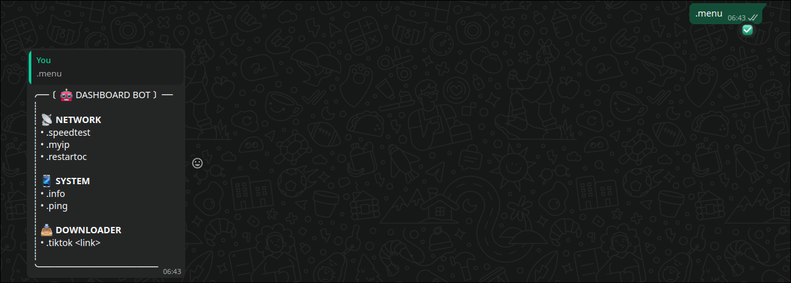
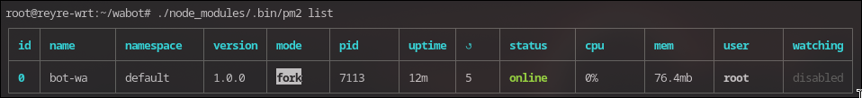

# 🤖 OpenWrt WhatsApp Bot (B860H Edition)


Lightweight WhatsApp Bot designed specifically for **OpenWrt STB (B860H/HG680P)** using `@whiskeysockets/baileys`. 
Built with performance in mind, featuring **Auto-Update (CI/CD)** via Cronjob and system monitoring tools.

## 📸 Preview

<div align="center">
  
  
</div>

## ✨ Features

- **⚡ Lightweight Core**: Optimized for low-RAM devices (STB).
- **🔄 CI/CD Auto Update**: Automatically pulls changes from GitHub & restarts PM2 via Cronjob.
- **📊 System Monitor**: Check RAM, Uptime, and CPU Temperature (`.info`).
- **🛠 Router Control**: Restart OpenClash service directly from WhatsApp (`.restartoc`).
- **🚀 Network Tools**: Built-in Speedtest (`.speedtest`) and IP Checker (`.myip`).
- **🎨 Media Tools**: TikTok Downloader (`.tiktok`).
- **🤖 AI Integration**: (Optional) Integrated with Gemini/Groq API.

## 📂 Project Structure

```text
├── src/
│   ├── handlers/    # Message logic & commands
│   ├── utils/       # System info, stickers, cron helper
│   ├── db/          # JSON database (if needed)
│   └── config.js    # Configuration file
├── server.js        # Entry point
├── deploy.sh        # Deployment script for Local PC
└── package.json
```

## 🚀 Installation

**Prerequisites**

1. STB with OpenWrt (Node.js & NPM installed).
2. Git & PM2 installed on STB.
3. `speedtest-cli` (Ookla) installed on STB for speedtest feature.

### 1. Clone Repository (On STB)

```bash
cd /root
git clone git@github.com:alwanjauza/openwrt-bot.git wabot
cd wabot
npm install --omit=dev
```

### 2. Configure Environment

Create a `.env` file in the root folder:

```bash
OWNER_NUMBER=628xxxxxxxx
PARTNER_NUMBER=628xxxxxxxx
BOT_NAME=OpenWrt Bot
NINJA_API_KEY=your_api_key
```

### 3. Start Application

Use PM2 to run the bot in the background:


```bash
# Install PM2 locally
npm install pm2

# Start Bot
./node_modules/.bin/pm2 start server.js --name "bot-wa" --max-memory-restart 150M

# Save State
./node_modules/.bin/pm2 save
```

### 4. Setup Auto-Boot (Service Init)

Create `/etc/init.d/bot-wa` to ensure the bot starts after reboot (waiting for internet connection).

## 🔄 CI/CD Workflow (Auto Update)

This project uses a **Pull-based CI/CD** suitable for devices behind NAT (no Public IP required).
1. **Dev:** Push code from Local PC to GitHub.
2. **Cron:** STB checks GitHub every 5 minutes.
3. **Update:** If a new commit exists, STB executes `git pull` -> `npm install` -> `pm2 restart`.

**Setup Cronjob on STB:** Add this to `Scheduled Tasks` (LuCI) or `crontab -e`:

```bash
*/5 * * * * /root/wabot/auto_update.sh
```

## 📝 Commands List

| Command                             | Description                                                     |
| ------------------------------------ | ------------------------------------------------------------- |
| `.menu`                              | Show all available commands               |
| `.info`                      | Show RAM, Temp, Uptime |
| `.speedtest`                | Run network speedtest on STB                            |
| `.restartoc`    | Restart OpenClash Service                                   |
| `.myip`            | Check Public IP & ISP                       |
| `.tiktok <link>` | Download TikTok video (No WM)                           |

## ⚠️ Disclaimer

This project is for educational purposes only. Use at your own risk. The developer is not responsible for any banned numbers.

## 📄 License

Distributed under the [MIT License.](LICENSE) See LICENSE for more information.